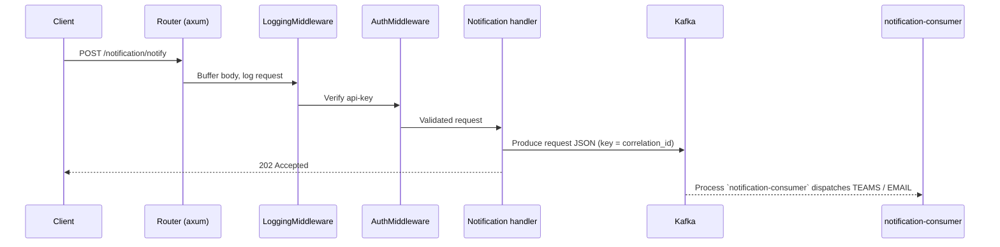

# Data Notification — Request Flow

Flow of an API call through `data-notification`.

## Routing `src/api/routes.rs`

- **Public:** `GET /health`, Swagger UI / OpenAPI JSON
- **Protected (`api-key` + logging), nested under `/notification`:** `POST /notification/notify`

## Logging `src/middlewares/logging.rs`

Buffers the request body, logs method/path/body (truncated), then logs the response.

## Auth `src/middlewares/auth.rs`

Header `api-key` compared to `auth.api_key`. See [`HMAC_AUTH.md`](HMAC_AUTH.md).

## Handler → Kafka

Thin handler normalizes + validates the request body and returns 400. The service checks catalog (memory then DB). If Kafka is on, it produces and the consumer dispatches TEAMS / EMAIL. If Kafka is off, the API process dispatches the channel directly.
